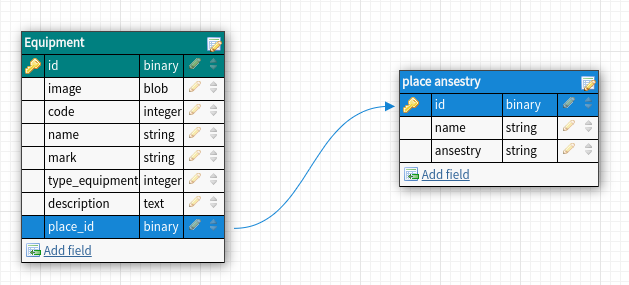

# README
### Projeto para Teste Full-Stack Ruby on Rails API + React + Docker + Postgres Vaga (Produttivo)

M.E.R 


Esta abordagem de arvore de setores ou locais me lembra uma estrutura em arvore então foi utilizado uma gem *ancestry* que me auxiliou na persistência e na representação desses locais. de modo em que cada equipamento cadastrado seja referenciado por um setor ou varios, para armazenamento de imagem de equipamento foi utilizado o ActiveStorage nativo do proprio rails, testes de TDD em rspec. Para uma melhor autonomia configurações resolvi roda o banco de dados em docker. 

Olá este projeto contem as seguintes stacks:

 * Ruby 3.1.3
 * Rails 7.0.4
 * React 18.2.1
 * Docker 20.10.22
 * Postgres (docker image)


##  Uso

```shel
git clone https://github.com/flaugabriel/flauzino-produttivo-app.git && cd flauzino-produttivo-app
```
Terminal 1
```shell
# setup
docker compose up 
```
Terminal 2
```shell
cd flauzino-produttivo-app
rails db:create db:migrate db:seed
rails s -p 3030
```
Terminal 3
```shell
cd flauzino-produttivo-app/client
npm install --force
npm run start
```


